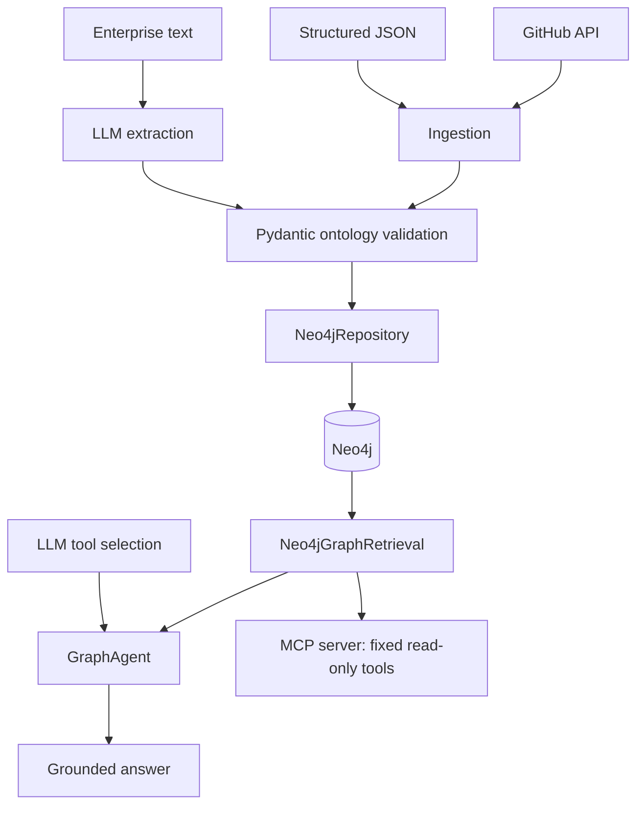

# Enterprise Ontology Agent

[](https://github.com/qwsvd/enterprise-ontology-agent/actions/workflows/ci.yml)

Enterprise Ontology Agent converts structured data, GitHub repository metadata,
and natural-language enterprise descriptions into a validated ontology stored in
Neo4j. It exposes deterministic graph retrieval to a grounded LLM tool-calling
agent and to four read-only MCP tools.

## Why this project exists

Information about people, teams, repositories, services, and incidents is often
fragmented across enterprise systems. An LLM answering from prior knowledge can
invent relationships; this project represents those relationships explicitly and
requires the agent to retrieve graph evidence before it can answer.

## What is implemented

- Typed Pydantic ontology objects and relations with domain/range validation
- Readable deterministic object IDs, including Unicode entity names
- An infrastructure-independent in-memory ontology graph
- Idempotent Neo4j object and relation persistence
- Optional provenance metadata with preservation on partial updates
- Validated structured JSON ingestion
- Public GitHub repository metadata ingestion with an optional API token
- OpenAI-compatible LLM extraction into validated ontology models
- Four fixed, typed Neo4j graph retrieval operations
- A bounded LLM function-calling agent with a completed-tool grounding guard
- A reproducible 20-case English/Chinese evaluation with trace-based metrics
- A stdio MCP v2 server exposing exactly four read-only graph tools
- Offline automated tests and GitHub Actions installation, test, and build checks

## Architecture



LLM extraction creates candidate ontology objects and relations, but Pydantic
validation remains authoritative. The MCP server does not call an LLM, and
neither the agent nor MCP clients can submit arbitrary Cypher.

## Ontology example

```text
Alice           → MEMBER_OF  → Payments
Payments        → OWNS       → Payment API
payment-service → IMPLEMENTS → Payment API
INC-204         → AFFECTS    → Payment API
```

The complete vocabulary is documented in [docs/ontology.md](docs/ontology.md).

## Grounded agent example

```powershell
python scripts/ask_agent.py "Who owns Payment API?"
# The Payments team owns the Payment API service.

python scripts/ask_agent.py "What service did INC-204 affect?"
# INC-204 affected the Payment API service.
```

These representative answers come from the local controlled benchmark artifact.
`GraphAgent` rejects a final answer if no approved graph retrieval tool has
completed first.

## Data ingestion

Structured JSON is validated and persisted through the existing repository:

```powershell
python scripts/ingest_json.py data/software_company_ontology.json
```

The GitHub importer fetches public repository metadata plus recent issue and pull
request lists, then persists the repository ontology object with provenance:

```powershell
python scripts/ingest_github.py owner/repo
```

Natural-language extraction prints validated objects and relations as JSON. Add
`--persist` to save them through `Neo4jRepository`:

```powershell
python scripts/extract_ontology.py data/sample_enterprise_text.txt
python scripts/extract_ontology.py data/sample_enterprise_text.txt --persist
```

## Quick start

Install [uv](https://docs.astral.sh/uv/), then clone and synchronize the locked
development environment:

```powershell
git clone https://github.com/qwsvd/enterprise-ontology-agent.git
cd enterprise-ontology-agent
uv sync --extra dev
```

Set the variables required by the path you want to run. These are safe example
values, not working credentials:

```powershell
$env:NEO4J_URI = "neo4j://localhost:7687"
$env:NEO4J_USERNAME = "neo4j"
$env:NEO4J_PASSWORD = "replace-with-your-password"
$env:NEO4J_DATABASE = "neo4j"

$env:LLM_API_KEY = "replace-with-your-api-key"
$env:LLM_BASE_URL = "https://api.openai.com/v1"
$env:LLM_MODEL = "replace-with-your-model"
```

Neo4j-backed commands require the four `NEO4J_*` values. Extraction, agent, and
evaluation commands that call an LLM require the three `LLM_*` values. The
project does not automatically load `.env`; set variables in the process
environment or load them with your own shell tooling.

## Typed graph retrieval

`Neo4jGraphRetrieval` supports exactly these operations:

- `owners_for_service(service_name)`
- `repositories_for_service(service_name)`
- `services_affected_by_incident(incident_name)`
- `teams_for_person(person_name)`

Their CLI equivalents are:

```powershell
python scripts/query_graph.py owners "Payment API"
python scripts/query_graph.py repositories "Payment API"
python scripts/query_graph.py affected-services "INC-204"
python scripts/query_graph.py teams "Alice"
```

Retrieval runs fixed, parameterized Cypher and returns validated
`OntologyObject` instances. It does not generate Cypher from natural language.

## MCP

The stdio-only MCP v2 server exposes the same four operations as read-only,
idempotent tools:

- `owners_for_service`
- `repositories_for_service`
- `services_affected_by_incident`
- `teams_for_person`

Start the server or inspect it during development:

```powershell
python scripts/mcp_server.py
mcp dev scripts/mcp_server.py
```

The server requires the Neo4j environment variables, exposes no arbitrary
Cypher, and contains no LLM call. Tests verify the server with an in-memory MCP
client; a live Inspector tool invocation is not claimed here.

## Evaluation

### Local controlled benchmark

The locally generated, uncommitted `artifacts/agent_eval_results.json` records a
completed run of the 20 checked-in English/Chinese cases in
`data/agent_eval_cases.json`.

| Metric | Result |
| --- | ---: |
| Tool selection accuracy | 100% |
| Argument accuracy | 100% |
| Expected entity recall | 100% |
| Grounded completion rate | 100% |
| No-result accuracy | 100% |
| Error rate | 0% |
| Mean latency | 1.469 s |
| p50 latency | 1.416 s |
| p95 latency | 1.857 s |

This is a small controlled benchmark of the checked-in sample graph and query
patterns, not a general accuracy or scalability claim. Evaluation reads an
existing graph and does not prepare or mutate it; live runs may consume LLM API
usage.

```powershell
python scripts/evaluate_agent.py
```

See [docs/evaluation.md](docs/evaluation.md) for metric definitions and
reproduction constraints.

## Tests and CI

```powershell
python -m pytest
```

The current suite contains 93 tests: 92 pass offline and one live Neo4j
integration test is skipped unless `RUN_NEO4J_INTEGRATION=1` is set. Normal
tests use fakes and do not require Neo4j, an LLM provider, the GitHub API, or
internet access.

GitHub Actions runs the suite on Python 3.12 from the committed `uv.lock` and
fails if the package cannot be built successfully. It does not publish a
package or deploy the application.

## Repository structure

```text
src/enterprise_ontology_agent/  Domain models and infrastructure adapters
scripts/                        Executable ingestion, query, agent, evaluation, and MCP entry points
tests/                          Offline unit/protocol tests and the opt-in Neo4j integration test
data/                           Sample ontology data, enterprise text, and evaluation cases
docs/                           Architecture, ontology, and evaluation details
.github/workflows/              Continuous integration workflow
```

## Design decisions

1. Ontology types and relation rules are validated before persistence.
2. Retrieval uses fixed parameterized Cypher instead of model-generated queries.
3. The agent must complete an approved graph tool before returning an answer.
4. Provenance is preserved when an update omits optional provenance fields.
5. Offline tests are separated from paid or live integrations.
6. MCP remains read-only and LLM-free.

## Limitations

- The ontology intentionally contains five object types and four relation types.
- Retrieval supports four fixed operations with exact, case-sensitive names.
- MCP supports stdio only; it has no authentication or HTTP transport.
- There is no vector, hybrid, embedding, or GraphRAG retrieval.
- The evaluation dataset is small and controlled.
- LLM extraction output is structurally validated, but its factual correctness
  is not independently verified.
- GitHub ingestion persists the repository object, not issue or pull-request
  ontology objects.
- The project is not designed or benchmarked for production scale.

## Roadmap

Future work may include a richer ontology, broader typed retrieval, a larger
evaluation set, authenticated HTTP MCP, and deployment observability.
