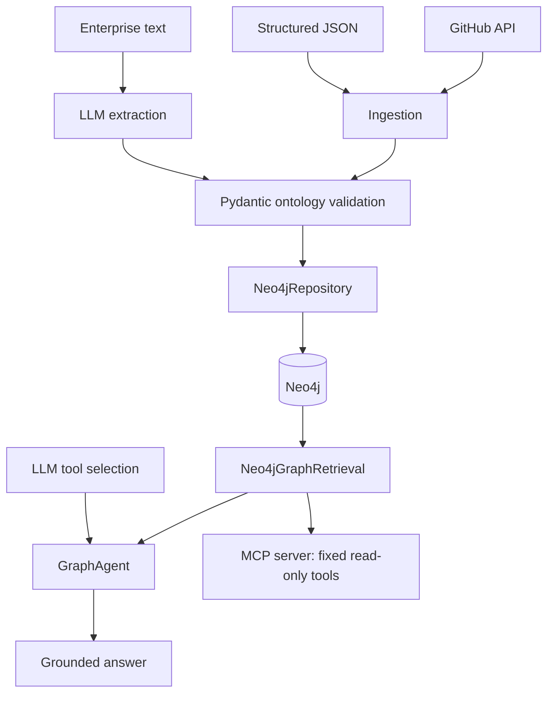
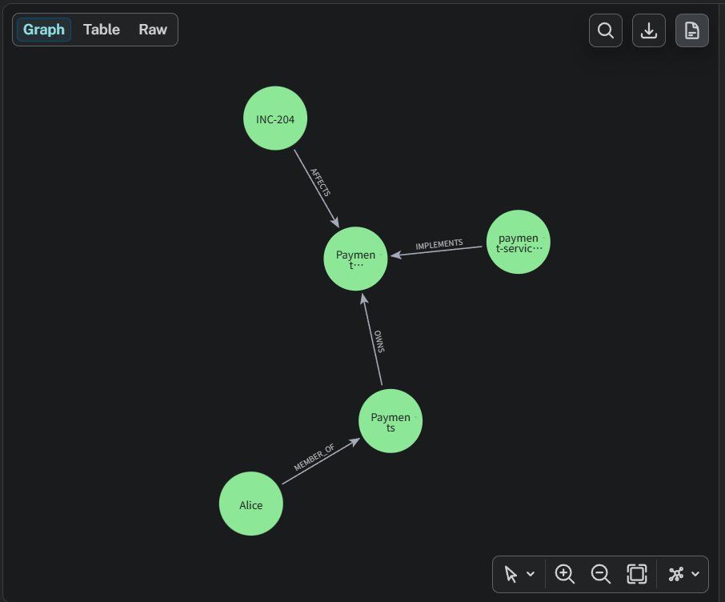
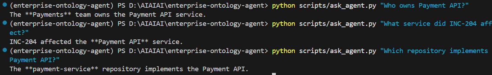

# Enterprise Ontology Agent

[](https://github.com/qwsvd/enterprise-ontology-agent/actions/workflows/ci.yml)

Enterprise Ontology Agent is an end-to-end enterprise knowledge system that
models people, teams, services, repositories, and incidents as a validated
ontology in Neo4j. It combines multi-source ingestion, LLM-based ontology
extraction, deterministic graph retrieval, grounded tool-calling agents,
evaluation, and read-only MCP access.

**Built with:** Python · Neo4j · Pydantic · LLM Tool Calling · MCP · GitHub Actions

**Verified:** 93 automated tests · CI passing · 20-case bilingual agent benchmark · reproducible package build

## Why this project exists

Information about people, teams, repositories, services, and incidents is often
fragmented across enterprise systems. An LLM answering from prior knowledge can
invent relationships; this project represents those relationships explicitly and
requires the agent to retrieve graph evidence before it can answer.

## What is implemented

- A bounded, grounded LLM tool-calling agent backed by four typed graph operations
- Fixed, parameterized Neo4j retrieval with validated ontology results
- OpenAI-compatible LLM extraction with deterministic Unicode object IDs
- Validated ingestion from structured JSON and public GitHub repositories
- Idempotent Neo4j persistence with provenance-safe updates
- Typed Pydantic ontology objects and domain/range-validated relations
- A reproducible 20-case English/Chinese agent evaluation with trace-based metrics
- A stdio MCP v2 server exposing exactly four read-only graph tools
- An infrastructure-independent in-memory ontology graph
- Offline automated tests, locked dependencies, CI, and package-build verification

## Architecture



LLM extraction creates candidate ontology objects and relations, but Pydantic
validation remains authoritative. The MCP server does not call an LLM, and
neither the agent nor MCP clients can submit arbitrary Cypher.

## Engineering Highlights

- **Typed knowledge modeling:** Pydantic models enforce object types, relation
  domain/range rules, nonblank identifiers, and provenance structure before data
  reaches persistence.
- **Evidence-grounded agent execution:** The bounded agent accepts a final answer
  only after an approved graph tool has completed, preventing ungrounded direct
  answers in the normal question flow.
- **Fixed parameterized graph retrieval:** Four explicit retrieval operations use
  parameterized Cypher, stable ordering, and validated `OntologyObject` results;
  the LLM cannot generate or execute arbitrary database queries.
- **Multi-source ingestion:** Structured JSON, public GitHub repository metadata,
  and natural-language extraction all converge on the same authoritative domain
  validation and Neo4j repository.
- **Reproducible trace-based evaluation:** Checked-in bilingual cases measure tool
  selection, arguments, expected entities, grounding, no-result behavior, errors,
  and latency from recorded agent traces.
- **CI and delivery baseline:** Locked Python 3.12 dependencies, offline tests,
  lockfile verification, and package builds run automatically in GitHub Actions.

## Running Demo



The persisted sample ontology connects people, teams, services, repositories,
and incidents through typed `MEMBER_OF`, `OWNS`, `IMPLEMENTS`, and `AFFECTS`
relationships.



The graph agent answers natural-language questions by selecting approved typed
retrieval tools and using the retrieved Neo4j evidence in its response.

## Ontology example

```text
Alice           → MEMBER_OF  → Payments
Payments        → OWNS       → Payment API
payment-service → IMPLEMENTS → Payment API
INC-204         → AFFECTS    → Payment API
```

The complete vocabulary is documented in [docs/ontology.md](docs/ontology.md).

## Grounded agent example

```powershell
python scripts/ask_agent.py "Who owns Payment API?"
# The Payments team owns the Payment API service.

python scripts/ask_agent.py "What service did INC-204 affect?"
# INC-204 affected the Payment API service.
```

These representative answers come from the local controlled benchmark artifact.
`GraphAgent` rejects a final answer if no approved graph retrieval tool has
completed first.

## Data ingestion

Structured JSON is validated and persisted through the existing repository:

```powershell
python scripts/ingest_json.py data/software_company_ontology.json
```

The GitHub importer fetches public repository metadata plus recent issue and pull
request lists, then persists the repository ontology object with provenance:

```powershell
python scripts/ingest_github.py owner/repo
```

Natural-language extraction prints validated objects and relations as JSON. Add
`--persist` to save them through `Neo4jRepository`:

```powershell
python scripts/extract_ontology.py data/sample_enterprise_text.txt
python scripts/extract_ontology.py data/sample_enterprise_text.txt --persist
```

## Quick start

Install [uv](https://docs.astral.sh/uv/), then clone and synchronize the locked
development environment:

```powershell
git clone https://github.com/qwsvd/enterprise-ontology-agent.git
cd enterprise-ontology-agent
uv sync --extra dev
```

Set the variables required by the path you want to run. These are safe example
values, not working credentials:

```powershell
$env:NEO4J_URI = "neo4j://localhost:7687"
$env:NEO4J_USERNAME = "neo4j"
$env:NEO4J_PASSWORD = "replace-with-your-password"
$env:NEO4J_DATABASE = "neo4j"

$env:LLM_API_KEY = "replace-with-your-api-key"
$env:LLM_BASE_URL = "https://api.openai.com/v1"
$env:LLM_MODEL = "replace-with-your-model"
```

Neo4j-backed commands require the four `NEO4J_*` values. Extraction, agent, and
evaluation commands that call an LLM require the three `LLM_*` values. The
project does not automatically load `.env`; set variables in the process
environment or load them with your own shell tooling.

## Typed graph retrieval

`Neo4jGraphRetrieval` supports exactly these operations:

- `owners_for_service(service_name)`
- `repositories_for_service(service_name)`
- `services_affected_by_incident(incident_name)`
- `teams_for_person(person_name)`

Their CLI equivalents are:

```powershell
python scripts/query_graph.py owners "Payment API"
python scripts/query_graph.py repositories "Payment API"
python scripts/query_graph.py affected-services "INC-204"
python scripts/query_graph.py teams "Alice"
```

Retrieval runs fixed, parameterized Cypher and returns validated
`OntologyObject` instances. It does not generate Cypher from natural language.

## MCP

The stdio-only MCP v2 server exposes the same four operations as read-only,
idempotent tools:

- `owners_for_service`
- `repositories_for_service`
- `services_affected_by_incident`
- `teams_for_person`

Start the server or inspect it during development:

```powershell
python scripts/mcp_server.py
mcp dev scripts/mcp_server.py
```

The server requires the Neo4j environment variables, exposes no arbitrary
Cypher, and contains no LLM call. Tests verify the server with an in-memory MCP
client; a live Inspector tool invocation is not claimed here.

## Evaluation

### 20-case controlled bilingual benchmark

The locally generated, uncommitted `artifacts/agent_eval_results.json` records a
completed run of the 20 checked-in English/Chinese cases in
`data/agent_eval_cases.json`.

| Metric | Result |
| --- | ---: |
| Tool selection accuracy | 20/20 (100%) |
| Argument accuracy | 20/20 (100%) |
| Expected entity recall | 16/16 positive cases (100%) |
| Grounded completion rate | 20/20 (100%) |
| No-result accuracy | 4/4 (100%) |
| Error rate | 0/20 (0%) |
| Mean latency | 1.469 s |
| p50 latency | 1.416 s |
| p95 latency | 1.857 s |

Results describe the checked-in controlled evaluation set and use the metric
definitions documented in [docs/evaluation.md](docs/evaluation.md). They do not
imply general model accuracy. Evaluation reads an existing graph and does not
prepare or mutate it; live runs may consume LLM API usage.

```powershell
python scripts/evaluate_agent.py
```

See [docs/evaluation.md](docs/evaluation.md) for metric definitions and
reproduction constraints.

## Tests and CI

```powershell
python -m pytest
```

The current suite contains 93 tests: 92 pass offline and one live Neo4j
integration test is skipped unless `RUN_NEO4J_INTEGRATION=1` is set. Normal
tests use fakes and do not require Neo4j, an LLM provider, the GitHub API, or
internet access.

GitHub Actions runs the suite on Python 3.12 from the committed `uv.lock` and
fails if the package cannot be built successfully. It does not publish a
package or deploy the application.

## Repository structure

```text
src/enterprise_ontology_agent/  Domain models and infrastructure adapters
scripts/                        Executable ingestion, query, agent, evaluation, and MCP entry points
tests/                          Offline unit/protocol tests and the opt-in Neo4j integration test
data/                           Sample ontology data, enterprise text, and evaluation cases
docs/                           Architecture, ontology, and evaluation details
.github/workflows/              Continuous integration workflow
```

## Key Engineering Decisions

### Typed validation before persistence

Ontology types and relation domain/range rules are enforced by Pydantic models
before objects or relations are sent to Neo4j.

### Fixed queries instead of generated Cypher

Retrieval uses four parameterized Cypher queries. Natural-language input can
select an approved tool, but it cannot become an arbitrary database query.

### Graph evidence required before an answer

The agent must successfully execute at least one approved retrieval tool before
returning a final response, including when the graph result is empty.

### Provenance-safe idempotent updates

Repeated persistence avoids duplicate objects and identical relations, keeps an
object's type immutable, and preserves stored provenance when an update omits it.

### Offline verification separated from live integrations

The default test suite uses injected fakes and skips the optional live Neo4j test,
so CI requires no database, provider credentials, or external API access.

### Read-only, LLM-free MCP boundary

MCP exposes the same four typed retrieval operations over stdio without embedding
an LLM or exposing arbitrary Cypher.

## Current Scope

- The ontology models five enterprise object types and four explicit relation
  types.
- Retrieval provides four deterministic, exact-name, case-sensitive graph
  operations with empty-list behavior when no fact matches.
- MCP provides those four operations as read-only stdio tools.
- Evaluation covers 20 controlled English and Chinese cases across all four tools,
  including positive and no-result scenarios.
- GitHub ingestion persists repository objects with provenance, while LLM
  extraction is structurally validated through the ontology models.

Detailed system boundaries and evaluation constraints are documented in
[docs/architecture.md](docs/architecture.md) and
[docs/evaluation.md](docs/evaluation.md).

## Next Extensions

- Expand ontology coverage and typed retrieval operations.
- Broaden multilingual and adversarial evaluation cases.
- Add authenticated remote MCP transport and operational observability.
